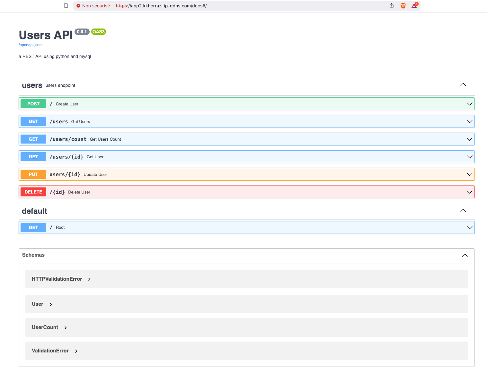

# Déploiement de microservices avec avec Kubernetes
Déploiement de deux microservices sur un cluster Kubernetes. Ci-dessous les 2 microservices à déployer :
- un service qui déploie l'application _streaming_fastapi_ 
- un second service qui déploie la base de données PostgreSQL
 
## Creation de l'image de l'application FastAPI  
Creation d'un regisry Docker local :
````sh 
docker run -itd -p 5000:5000 --name kkh-registry registry
````
Build de l'image Docker:
````sh 
docker build .-t streaming_fastapi_image:1.0
````
Tag et publication d'une version de l'image dans le registry local afin de pouvoir l'utiliser avec ***kubectl***:
````sh 
docker tag streaming_fastapi_image:latest localhost:5000/streaming_fastapi_image:1.0
docker push localhost:5000/streaming_fastapi_image:1.0
````
 
## Creation des objets Kubernetes


***Secrets*** pour passer les éléments de configurations sensibles 
````sh 
kubectl apply -f YAML-STANDAR/secret.yaml
````
***ConfigMap*** pour tout type d'information non-sensible
````sh 
kubectl apply -f YAML-STANDAR/configmap.yaml
````
***Persistant Volum Claim*** qui utilise la classe de stockage par défaut de Rancher (StorageClass) 
````sh 
kubectl apply -f YAML-STANDAR/pvc.yaml
````
***Statefulset*** Deployment  pour la base de données
````sh 
kubectl apply -f YAML-STANDAR/postgres-statefulset.yaml 
````
***Service*** pour exposer le Pode le la base de donnés
````sh 
kubectl apply -f YAML-STANDAR/postgres-service.yaml 
````
***Deployment*** de l'application FastAPI
````sh 
kubectl apply -f YAML-STANDAR/node-deployment.yaml
````
***Service*** pour exposer les Podes le l'API.
````sh 
kubectl apply -f YAML-STANDAR/node-service.yaml
````
***Ingress*** pour lier le micro service FastAP au nom de domaine public. 
````sh 
kubectl apply -f YAML-STANDAR/ingress.yaml
````
## Interogation de l'API 



Insertion de nouveaux utilisateurs
````sh 
curl -X 'POST' -i \
  'http://app2.kkherrazi.ip-ddns.com/' \
  -H 'Content-Type: application/json' \
  -d '{  
    "name": "khalid",
    "email": "khalid@kherrazi@gmail.com",
    "password": "unpassword"
}'
````
Consulter le nombre des utilisateurs
````sh 
echo "USERS COUNT : "
curl -X 'GET' -i 'http://app2.kkherrazi.ip-ddns.com/users/count' -H 'Content-Type: application/json'  
```` 

# Backup Postgres
Création d'une sauvegarde de la base de données Postgres au niveau du **Volume Persisitant** 
````sh 
kubectl exec postgres-deployment-0 -- pg_dump -U admin -d storedb -f /var/lib/postgresql/data/BACKUP_storedb.sql
````

# Logs 
Affichage de la liste des Pods en cours d'execution :
````sh 
ubuntu@ip-172-31-46-126:~/myprojects/streaming-users-api$ kubectl get pods
NAME                                  READY   STATUS    RESTARTS        AGE
curl                                  1/1     Running   1 (3h27m ago)   3h36m
fastapi-deployment-69b4b65499-2fw4p   1/1     Running   2 (37s ago)     42s
fastapi-deployment-69b4b65499-2lz8w   1/1     Running   2 (36s ago)     42s
fastapi-deployment-69b4b65499-xdnsw   1/1     Running   2 (37s ago)     42s
postgres-deployment-0                 1/1     Running   0               42s
````

Consultation des logs du StatfulSet:
````sh 
ubuntu@ip-172-31-46-126:~/myprojects/streaming-users-api$ kubectl logs postgres-deployment-0 
The files belonging to this database system will be owned by user "postgres".
This user must also own the server process.

The database cluster will be initialized with locale "en_US.utf8".
The default database encoding has accordingly been set to "UTF8".
The default text search configuration will be set to "english".

Data page checksums are disabled.

fixing permissions on existing directory /var/lib/postgresql/data ... ok
creating subdirectories ... ok
selecting dynamic shared memory implementation ... posix
selecting default max_connections ... 100
selecting default shared_buffers ... 128MB
selecting default time zone ... UTC
creating configuration files ... ok
running bootstrap script ... ok
sh: locale: not found
2025-04-08 02:04:32.400 UTC [27] WARNING:  no usable system locales were found
performing post-bootstrap initialization ... ok
syncing data to disk ... ok


Success. You can now start the database server using:

    pg_ctl -D /var/lib/postgresql/data -l logfile start

initdb: warning: enabling "trust" authentication for local connections
You can change this by editing pg_hba.conf or using the option -A, or
--auth-local and --auth-host, the next time you run initdb.
waiting for server to start....2025-04-08 02:04:33.044 UTC [31] LOG:  starting PostgreSQL 12.0 on x86_64-pc-linux-musl, compiled by gcc (Alpine 8.3.0) 8.3.0, 64-bit
2025-04-08 02:04:33.049 UTC [31] LOG:  listening on Unix socket "/var/run/postgresql/.s.PGSQL.5432"
2025-04-08 02:04:33.077 UTC [32] LOG:  database system was shut down at 2025-04-08 02:04:32 UTC
2025-04-08 02:04:33.087 UTC [31] LOG:  database system is ready to accept connections
 done
server started
CREATE DATABASE


/usr/local/bin/docker-entrypoint.sh: ignoring /docker-entrypoint-initdb.d/*

waiting for server to shut down....2025-04-08 02:04:33.229 UTC [31] LOG:  received fast shutdown request
2025-04-08 02:04:33.232 UTC [31] LOG:  aborting any active transactions
2025-04-08 02:04:33.234 UTC [31] LOG:  background worker "logical replication launcher" (PID 38) exited with exit code 1
2025-04-08 02:04:33.234 UTC [33] LOG:  shutting down
2025-04-08 02:04:33.253 UTC [31] LOG:  database system is shut down
 done
server stopped

PostgreSQL init process complete; ready for start up.

2025-04-08 02:04:33.340 UTC [1] LOG:  starting PostgreSQL 12.0 on x86_64-pc-linux-musl, compiled by gcc (Alpine 8.3.0) 8.3.0, 64-bit
2025-04-08 02:04:33.340 UTC [1] LOG:  listening on IPv4 address "0.0.0.0", port 5432
2025-04-08 02:04:33.340 UTC [1] LOG:  listening on IPv6 address "::", port 5432
2025-04-08 02:04:33.346 UTC [1] LOG:  listening on Unix socket "/var/run/postgresql/.s.PGSQL.5432"
2025-04-08 02:04:33.367 UTC [42] LOG:  database system was shut down at 2025-04-08 02:04:33 UTC
2025-04-08 02:04:33.373 UTC [1] LOG:  database system is ready to accept connections
````

Consultation des logs des 3 Pods de l'API:
````sh 
ubuntu@ip-172-31-46-126:~/myprojects/streaming-users-api$ kubectl logs fastapi-deployment-69b4b65499-2fw4p
INFO:     Started server process [1]
INFO:     Waiting for application startup.
INFO:     Application startup complete.
INFO:     Uvicorn running on http://0.0.0.0:5000 (Press CTRL+C to quit)
ubuntu@ip-172-31-46-126:~/myprojects/streaming-users-api$ kubectl logs fastapi-deployment-69b4b65499-2lz8w
INFO:     Started server process [1]
INFO:     Waiting for application startup.
INFO:     Application startup complete.
INFO:     Uvicorn running on http://0.0.0.0:5000 (Press CTRL+C to quit)
ubuntu@ip-172-31-46-126:~/myprojects/streaming-users-api$ kubectl logs fastapi-deployment-69b4b65499-xdnsw
INFO:     Started server process [1]
INFO:     Waiting for application startup.
INFO:     Application startup complete.
INFO:     Uvicorn running on http://0.0.0.0:5000 (Press CTRL+C to quit)
````

 
## Supprission des resources 
````sh   
kubectl delete -f YAML-STANDAR/ingress.yaml
kubectl delete -f YAML-STANDAR/node-service.yaml
kubectl delete -f YAML-STANDAR/node-deployment.yaml

kubectl delete -f YAML-STANDAR/postgres-service.yaml 
kubectl delete -f YAML-STANDAR/postgres-statefulset.yaml 
kubectl delete -f YAML-STANDAR/secret.yaml
kubectl delete -f YAML-STANDAR/configmap.yaml
kubectl delete -f YAML-STANDAR/pvc.yaml
````

